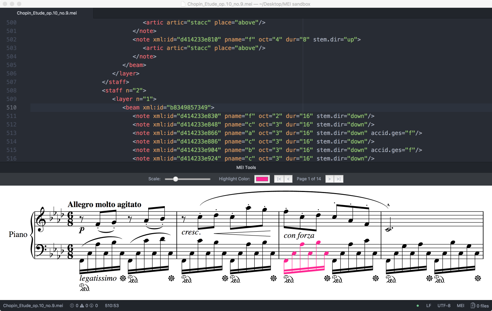
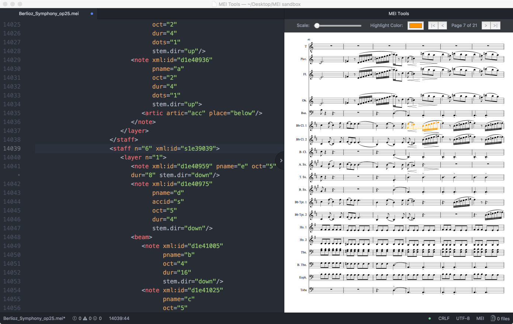
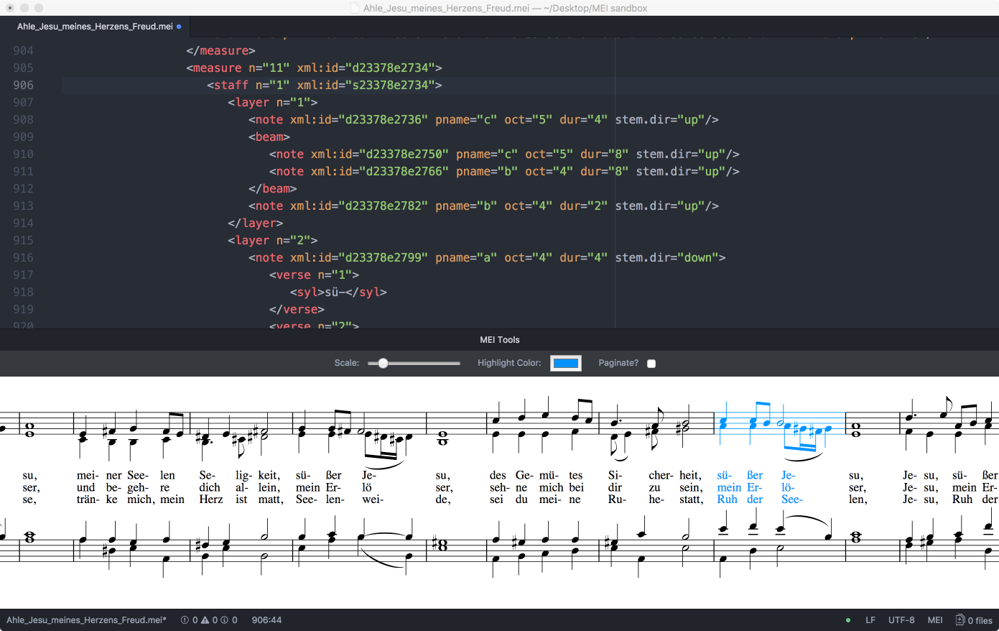

# mei-tools-atom

[MEI](http://music-encoding.org/) is an open-source XML-based system for the semantic encoding of music documents. This package, for use with the open-source [Atom text editor](https://atom.io/), provides on-the-fly rendering of MEI into music notation with _[Verovio](http://www.verovio.org/)_.

__This package is currently under development__ and there are known performance issues with large files.  Contributions are welcome.

## Screenshots




## Current Features

- As-you-type rendering into music notation with _[Verovio](http://www.verovio.org/)_
- Scale notation (zoom in or out) for ease of viewing
- Pagination allows larger files to be rendered into notation with better performance
- Flow measures horizontally for smaller files
- Element under cursor in MEI code is highlighted in notation
    - this feature works by matching `xml:id`s, so if you have no `xml:id`s on your elements you will have no highlighting in your notation
    - if the current element has no `xml:id`, the parent `<staff>` and then `<measure>` will be checked and highlighted if an `xml:id` is found
- Choose color for highlighting
- Click on a note or other rendered notation element to take the cursor to the associated place in the MEI code
    - also relies on `xml:id`s, so elements without `xml:id`s do not provide this feature

## Planned Features
- Create function to automatically generate `xml:id`s
- Address remaining performance issues with large documents
- Integrate validation and autocomplete?
- Integrate other XML helper tools and style sheets?

## Installation
This package is not yet published to the official Atom registry, so there are a few extra steps for installation that require use of the command line.
1. Download and install the [Atom text editor](https://atom.io/).
1. Launch Terminal (if you are using a Mac or Linux operating system) or another command-line tool.
1. Type `which git` into your Terminal window and press enter.  If there is no return value, you will need to [install Git](https://git-scm.com/book/en/v2/Getting-Started-Installing-Git) before proceeding to the next steps.
1. Type `which npm` into your Terminal window and press enter.  If there is no return value, you will need to [install Node and NPM](https://www.npmjs.com/get-npm) before proceeding to the next steps.
1. Once Git and Node/NPM are installed, copy and paste the following commands into your Terminal window and press enter:
    ```
    cd ~/.atom/packages
    git clone https://github.com/siennamw/mei-tools-atom.git
    cd mei-tools-atom
    npm install
    ```
1. Launch Atom and open an MEI file (File > Open...).
    - [this is a nice example encoding](https://raw.githubusercontent.com/music-encoding/sample-encodings/master/MEI_3.0/Music/Complete_examples/Chopin_Etude_op.10_no.9.mei) - save with the `.mei` extension (delete anything after `.mei`)
    - [more examples of MEI 3.0 encodings can be found here](https://github.com/music-encoding/sample-encodings/tree/master/MEI_3.0/Music/Complete_examples)
1. If prompted to install dependencies, click 'yes' and allow installation to complete.
1. To display the notation, go to Packages > MEI Tools > Show/Hide Notation, or simply press `Ctrl Option Cmd M`.

## Dependencies
This package requires [atom-language-mei](https://github.com/nCoda/atom-language-mei), which will be installed automatically when this package is installed.

## Validating your MEI
Only valid MEI can be rendered into notation with _[Verovio](http://www.verovio.org/)_. To ensure your MEI is valid, an XML validation package is recommended.  [linter-autocomplete-jing](https://github.com/aerhard/linter-autocomplete-jing) was designed for use with TEI and MEI, so I recommend starting there.  Please note that [linter-autocomplete-jing](https://github.com/aerhard/linter-autocomplete-jing) requires Java Runtime Environment (JRE) v1.6 or above.  [Visit the package repository](https://github.com/aerhard/linter-autocomplete-jing) for details.

## Gratitude
Thanks to Laurent Pugin and the MEI community for [all their work on _Verovio_](https://github.com/rism-ch/verovio).  Thanks also to Laurent for making _Verovio_ available to me as a Node package.
